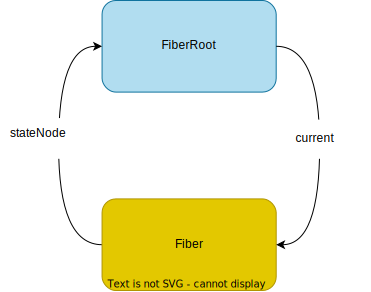

import ReactSourceHighlight from '@site/src/components/ReactSource';

# React 入口


一个典型的React 应用程序入口文件如下：

```jsx
import React from 'react';
import { createRoot } from 'react-dom/client';

const App = () => {
    return (<div>...</div>)
}

const root = createRoot(document.getElementById('root'));
root.render(App);
```

可以看到root.render 是react渲染的入口。

首先看 createRoot 的实现，
<ReactSourceHighlight path="packages/react-dom/client.js#L25-L39" highlight="33" />
<ReactSourceHighlight path="packages/react-dom/src/client/ReactDOM.js#L150-L163" highlight="162" />

<ReactSourceHighlight path="packages/react-dom/src/client/ReactDOMRoot.js#L166-L169"  />
<ReactSourceHighlight path="packages/react-dom/src/client/ReactDOMRoot.js#L176-L180"  />
<ReactSourceHighlight path="packages/react-dom/src/client/ReactDOMRoot.js#L204-L243" highlight="224,234,240,242" />


可以看到主要的2步是 `createContainer` 和 `new ReactDOMRoot`,先看 `createContainer`的实现,

``` js
  const root = createContainer(
    container,
    ConcurrentRoot,
    ...
  );
```

`container` 就是传入的 `document.getElementById('root')` element节点，

`enableNewReconciler=false`


<ReactSourceHighlight path="packages/react-reconciler/src/ReactFiberReconciler.js#L93-L95" />
<ReactSourceHighlight path="packages/react-reconciler/src/ReactFiberReconciler.old.js#L247-L271" />
<ReactSourceHighlight path="packages/react-reconciler/src/ReactFiberRoot.old.js#L132-L208" />

最后返回了`root`，`root`是个`FiberRoot`对象, `uninitializedFiber` 是个`Fiber`对象, `FiberRoot`与`Fiber`进行了双向绑定。




继续看 `ReactDOMRoot` 做了什么

``` js
new ReactDOMRoot(root)
```

<ReactSourceHighlight path="packages/react-dom/src/client/ReactDOMRoot.js#L88-L98" />
<ReactSourceHighlight path="packages/react-dom/src/client/ReactDOMRoot.js#L134-L135" />

可见 `ReactDOMRoot` 继承了`FiberRoot`对象，包装了一些方法，如 `render`、`unmount`等

我们可以看到`render`方法调用了`updateContainer`方法，继续看`updateContainer`的实现

